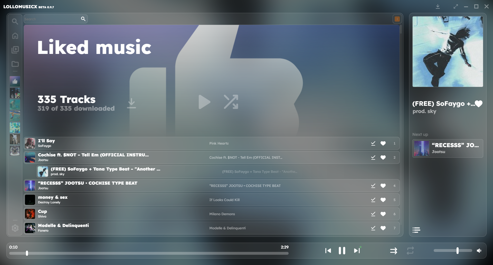
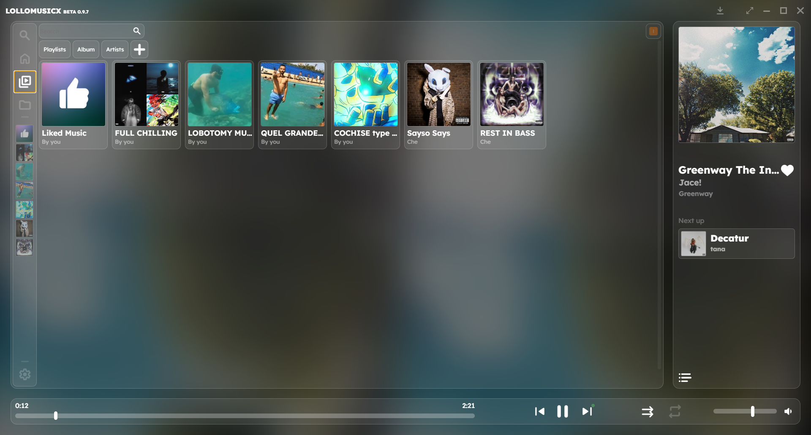
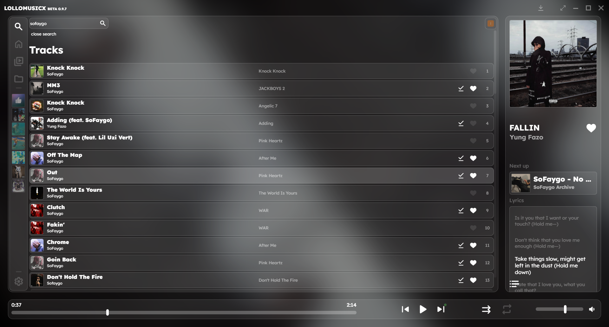
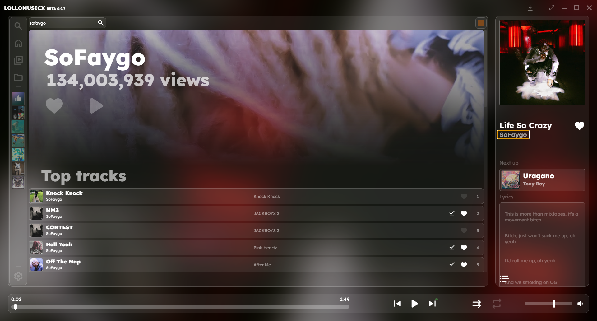
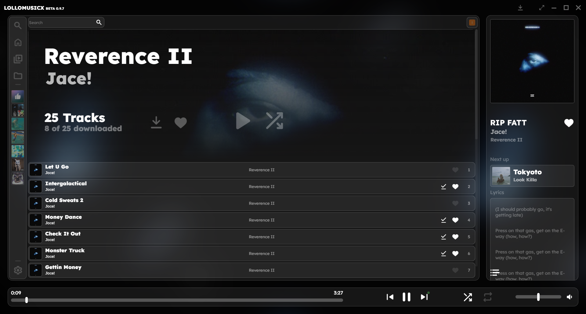
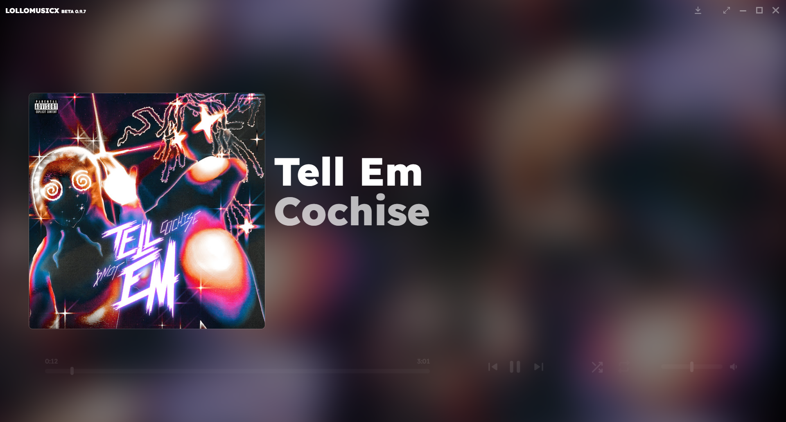

# LOLLOMUSICX









LOLLOMUSICX desktop music player built with Electron and Svelte. It offers an integrated experience for streaming from YouTube Music and managing your local music library.

---

## Key Features

- **YouTube Music Streaming**: Search and play songs, albums, artists, and playlists directly from YouTube Music.
- **Local Music Library**: Add local folders to scan and play your `.mp3` and `.wav` files.
- **Unified Library Management**: Save your favorite songs, albums, and artists from both YouTube and local sources.
- **Custom Playlists**: Create and manage local playlists.
- **Song Downloads**: Download your favorite tracks for offline listening.
- **Lyrics Display**: Find and display lyrics for the currently playing song.
- **Discord Integration**: Show your listening activity on Discord (Discord Rich Presence).

---

## Tech Stack

- **Framework**: [Electron](https://www.electronjs.org/)
- **UI**: [Svelte](https://svelte.dev/)
- **Build Tool**: [Vite](https://vitejs.dev/) (via `electron-vite`)
- **Packaging**: [Electron Builder](https://www.electron.build/)
- **YouTube API**: `youtubei.js`, `playwright` for authentication.
- **LOLLOMUSICX API**: authentic API made just for [lollomusic].
- **Local Audio Management**: `music-metadata` for reading metadata and `fluent-ffmpeg` for processing.

---

## Prerequisites

Before you begin, ensure you have the following installed:

- [Node.js](https://nodejs.org/) (LTS version recommended)
- `npm` (included with Node.js)
- `python` (required for `lollomusicx api` to work) (its suggested to download it by the microsoft store or by using the command `Python` in the power shell)

---

## Installation and Setup

1.  **Clone the repository:**
    ```bash
    git clone <REPOSITORY_URL>
    cd LOLLOMUSICX
    ```

2.  **Install dependencies:**
    This command will install all necessary dependencies, including local packages like `lollomusic-api`.
    ```bash
    npm install
    ```

3.  **Install dependencies:**
    This command will install a Python package required for the `lollomusicx api` to work.
    ```bash
    pip install ytmusicapi
    ```

4.  **Install Playwright Browsers:**
    This command will install the required browsers for Playwright to work.
    ```bash
    npx playwright install
    ```

5.  **Run in development mode:**
    This will start the application with hot-reloading for a smooth development experience.
    ```bash
    npm run dev
    ```

---

### Build and package installation 

To build the application and create installers for your platform, use the following commands:

- **Windows**: `npm run build:win`

- lollomusic is only available for windows for now.

These commands will generate platform-specific installers in the `dist_electron` directory.

---

### First Run and Authentication

On the first launch, the application will open a chromium window (managed by Playwright) prompting you to log into your YouTube Music account. 
This step will allow the app to save the browser session.

once the chromium window is open:

- log in to your youtube music account.
- after the Youtube Music page is loaded, press the reload page button, the browser will be closed automaticaly

---

## Available Scripts

These commands are defined in the `package.json` file:

| Command              | Description                                               |
| -------------------- | --------------------------------------------------------- |
| `npm run dev`        | Starts the app in development mode with hot-reloading.    |
| `npm run build`      | Compiles and prepares the app for production.             |
| `npm run build:win`  | Creates the installer package for Windows (`.exe`).       |
| `npm run build:mac`  | Creates the installer package for macOS (`.dmg`).         |
| `npm run build:linux`| Creates the packages for Linux (`.AppImage`, `.deb`).     |
| `npm run format`     | Formats the code using Prettier.                          |
| `npm run lint`       | Runs static code analysis with ESLint.                    |

---

## Project Structure

```
.
├── dist_electron/    # Production build output
├── src/
│   ├── main/         # Electron main process code (backend)
│   │   ├── index.js  # Main entry point, handles windows and IPC
│   │   └── ...
│   ├── preload/      # Preload scripts for the main-renderer bridge
│   └── renderer/     # Renderer process code (Svelte frontend)
├── electron.vite.config.mjs # Electron-Vite configuration
├── package.json      # Project dependencies and scripts
└── ...
```

-   **`src/main`**: Contains the application's "backend" logic. It manages windows, file system access, external API calls, and Inter-Process Communication (IPC)
    (the lollomusicx api in this folder is discontinued and will be removed in the future, please install `.tgz` file in the main directory)

-   **`src/renderer`**: Contains the user interface built with Svelte. It communicates with the `main` process via `preload` scripts to perform backend operations.
-   **`src/preload`**: Acts as a secure bridge, selectively exposing `main` process APIs to the `renderer` process in a controlled manner.

---

## The API

`Lollomusicx api` will be soon available in another repository.

---

## License

This project is licensed under the MIT License. See the [LICENSE](LICENSE) file for details.


---


> Disclaimer: This project is currently in beta and is maintained by a single developer. As such, you may encounter bugs or incomplete features. 
  Feedback and contributions are highly appreciated!               
